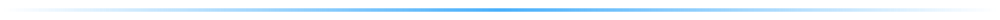

  

### السَّلَامُ عَلَيْكُمْ وَرَحْمَةُ اللهِ وَبَرَكَاتُهُ ✨

## About me

Flutter developer and software engineer with **3+ years** of experience building production-ready, cross-platform apps for **Android** and **iOS**.

- Shipped **7+** projects on time, from first screen to release — auth, APIs, notifications, pagination, and dynamic UI
- Build complete **authentication** flows: sign up, login, sessions, tokens, and protected screens
- Integrate **REST APIs** with **Dio** — headers, Bearer tokens, JSON models, pagination, retries, and loading / error / empty states
- Work with **Firebase**: Auth, Cloud Messaging (**FCM**), App Distribution, and Analytics
- Work with **Supabase**: Auth, Postgres tables, realtime updates, and row-level security
- Handle real backend work: data processing, CRUD, filtering, and API-driven screens that stay in sync with the server
- Manage state with **Bloc / Cubit** so the UI stays reactive and business logic stays testable
- Structure apps with **Clean Architecture**, **MVVM**, and **feature-first** folders that scale with the product
- Separate UI, domain, and data layers (repositories + remote data sources) instead of calling APIs from widgets
- Build responsive, user-friendly interfaces: adaptive layouts, empty states, and smooth day-to-day UX
- Care about performance and polish — fast screens, clean navigation, and fixing real production issues before they ship
- Take features through the full cycle: implementation, debugging, testing, and store-ready / distribution builds
- Comfortable adapting quickly to new tools, APIs, and product requirements
- Background in **C++** problem solving (algorithms & data structures)
- Based in **Damietta, Egypt** — open to Flutter roles, freelance work, and high-impact mobile products

  

## Tech stack

  

 

  
  
  
  
  
  
  
  
  
  
  

  

 

  

 

  

**Let’s build something useful.**

